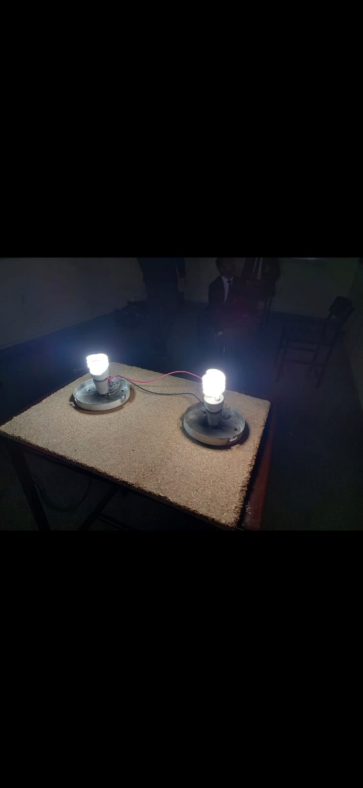

<!DOCTYPE html>
<html lang="en">
<head>
    <meta charset="UTF-8">
    <meta name="viewport" content="width=device-width, initial-scale=1.0">
    <title>Ayaan Waqar - Projects</title>
    
</head>
<body>
    

        <h1>Ayaan Waqar</h1>
        
Welcome to my project portfolio. Here you'll find some of the projects I've been working on, including RC cars, sensors, IoT devices, and more, each built to push boundaries and explore possibilities in technology.

    

    

        <!-- Project 1 -->
        

            <a href="https://github.com/username/epilet-repo" target="_blank">
                
                

                    <h3>The Epilet</h3>
                    
A band for epilepsy patients that allows tonic-clonic seizure detection and alerts.

                

            </a>
        

        <!-- Project 2 -->
        

            <a href="https://github.com/AyaanWaqar/Obstacle-Avoiding-RCcars" target="_blank">
                
                

                    <h3>Autonomous Car</h3>
                    
RC car developed using UltraSonic Sensor to maneuver around obstacles.

                

            </a>
        

        <!-- Project 3 -->
        

            <a href="https://github.com/AyaanWaqar/DiabeticFoot" target="_blank">
                
                

                    <h3>Diabetic Foot Analyzer</h3>
                    
A device developed for diabetic patients.

                

            </a>
        

        <!-- Add more project cards in the same format -->

        <!-- Project 16 (Example for the last project) -->
        

            <a href="https://github.com/AyaanWaqar/LEDs" target="_blank">
                
                

                    <h3>LEDs</h3>
                    
Starting from the basics with LEDs and advancing to more complex projects.

                

            </a>
        

    

</body>
</html>
