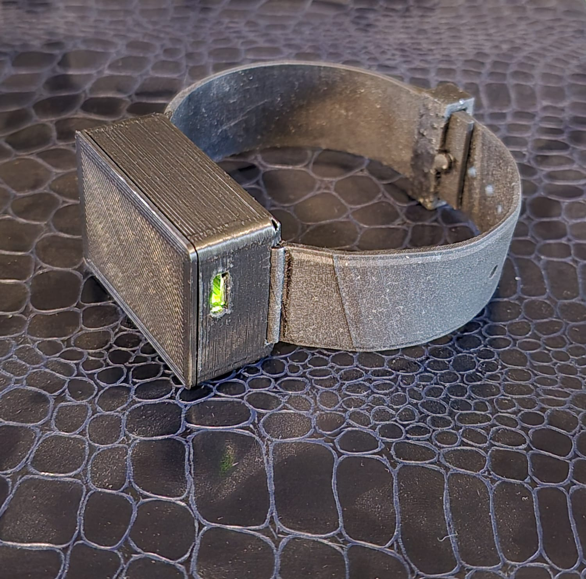
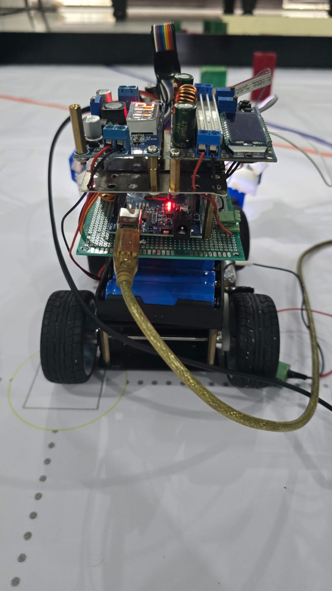
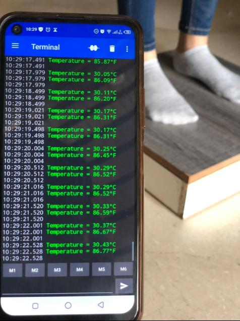
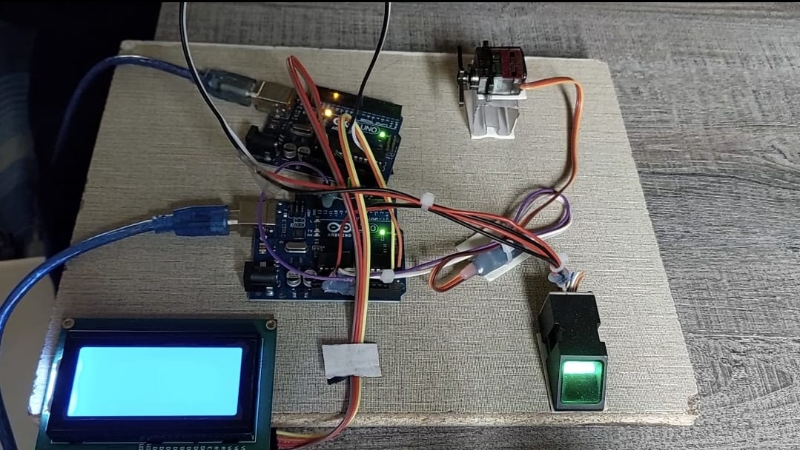
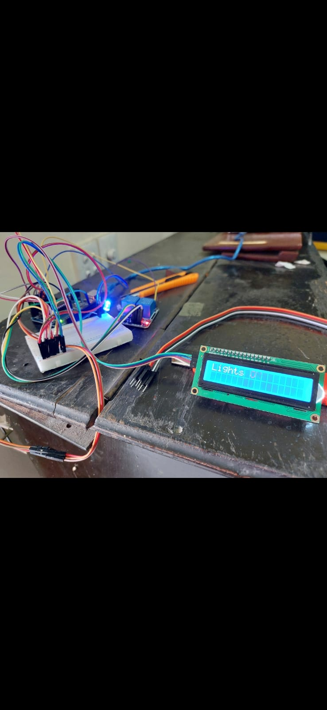

<html lang="en">
<head>
    <meta charset="UTF-8">
    <meta name="viewport" content="width=device-width, initial-scale=1.0">
    <title>Ayaan Waqar</title>
    
</head>
<body>
    

        <h1>Ayaan Waqar's Projects</h1>
    

    

        <!-- Project 1 -->
        

            
            <h3>The Epilet</h3>
            
A band for epilepsy patients that allows tonic-clonic seizure detection and alerts.

        

        <!-- Project 2 -->
        

            
            <h3>Autonomous Car</h3>
            
RC car developed using UltraSonic Sensor to maneuver around obstacles.

        

        <!-- Project 3 -->
        

            
            <h3>Diabetic Foot Analyzer</h3>
            
A device devloped for Diabetic Patients.

        

        <!-- Project 4 -->
        

            
            <h3>FingerPrint DoorLock</h3>
            
A lock developed using a fingerprint sensor, servo motor and LCD.

        

        <!-- Project 5 -->
        

            
            <h3>Bluetooth Controlled RC Car</h3>
            
An RC car controlled via a bluetooth module.

        

        <!-- Project 6 -->
        

            
            <h3>Project Title 6</h3>
            
A brief description of Project 6. Explain the purpose and technology used.

        

        <!-- Project 7 -->
        

            
            <h3>Project Title 7</h3>
            
A brief description of Project 7. Explain the purpose and technology used.

        

        <!-- Project 8 -->
        

            
            <h3>Project Title 8</h3>
            
A brief description of Project 8. Explain the purpose and technology used.

        

        <!-- Project 9 -->
        

            
            <h3>Project Title 9</h3>
            
A brief description of Project 9. Explain the purpose and technology used.

        

        <!-- Project 10 -->
        

            
            <h3>Project Title 10</h3>
            
A brief description of Project 10. Explain the purpose and technology used.

        

        <!-- Project 11 -->
        

            
            <h3>Project Title 11</h3>
            
A brief description of Project 11. Explain the purpose and technology used.

        

        <!-- Project 12 -->
        

            
            <h3>Project Title 12</h3>
            
A brief description of Project 12. Explain the purpose and technology used.

        

        <!-- Project 13 -->
        

            
            <h3>Project Title 13</h3>
            
A brief description of Project 13. Explain the purpose and technology used.

        

        <!-- Project 14 -->
        

            
            <h3>Project Title 14</h3>
            
A brief description of Project 14. Explain the purpose and technology used.

        

    

</body>
</html>
