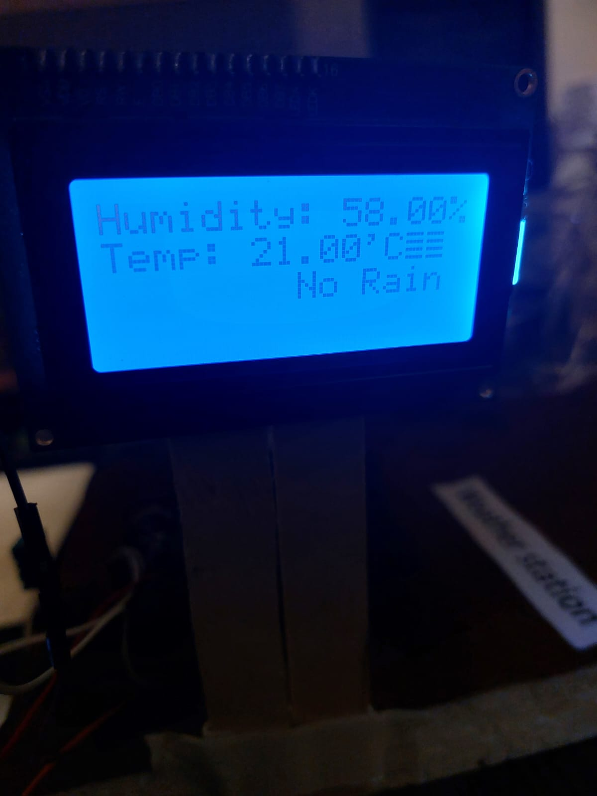

<html lang="en">
<head>
    <meta charset="UTF-8">
    <meta name="viewport" content="width=device-width, initial-scale=1.0">
    <title>Ayaan Waqar</title>
    
</head>
<body>
    

        <h1>Ayaan Waqar's Projects</h1>
    

    

        <!-- Project 1 -->
        

            
            <h3>The Epilet</h3>
            
A band for epilepsy patients that allows tonic-clonic seizure detection and alerts.

        

        <!-- Project 2 -->
        

            
            <h3>Autonomous Car</h3>
            
RC car developed using UltraSonic Sensor to maneuver around obstacles.

        

        <!-- Project 3 -->
        

            
            <h3>Diabetic Foot Analyzer</h3>
            
A device devloped for Diabetic Patients.

        

        <!-- Project 4 -->
        

            
            <h3>FingerPrint DoorLock</h3>
            
A lock developed using a fingerprint sensor, servo motor and LCD.

        

        <!-- Project 5 -->
        

            
            <h3>Bluetooth Controlled RC Car</h3>
            
An RC car controlled via a bluetooth module.

        

        <!-- Project 6 -->
        

            
            <h3>LCD Projects</h3>
            
The use of LCDs in various operations.

        

        <!-- Project 7 -->
        

            
            <h3>Relay Module</h3>
            
The use of relay switches to allow high voltage components to be used with arduino

        

        <!-- Project 8 -->
        

            
            <h3>MLX Temperature Sensor</h3>
            
The use of temperature sensors to input farenhiet and celcius readings

        

        <!-- Project 9 -->
        

            
            <h3>Hard Coded RC car</h3>
            
Hard Coding a car to complete specific timed trials.

        

        <!-- Project 10 -->
        

            
            <h3>Sound Detection</h3>
            
Detecting a clap to switch lights on and off.

        

        <!-- Project 11 -->
        

            
            <h3>Line Following RC Car</h3>
            
Created a line following RC car using numerious IR sensors.

        

        <!-- Project 12 -->
        

            
            <h3>Bluetooth with Components</h3>
            
The use of Bluetooth to manipulate various components.

        

        <!-- Project 13 -->
        

            
            <h3>Servo Motor Use</h3>
            
The use of a servo motor in various projects.

        

        <!-- Project 14 -->
        

            
            <h3>Motion Detection</h3>
            
The use of motion sensors to pick up movement.

        

    

</body>
</html>
